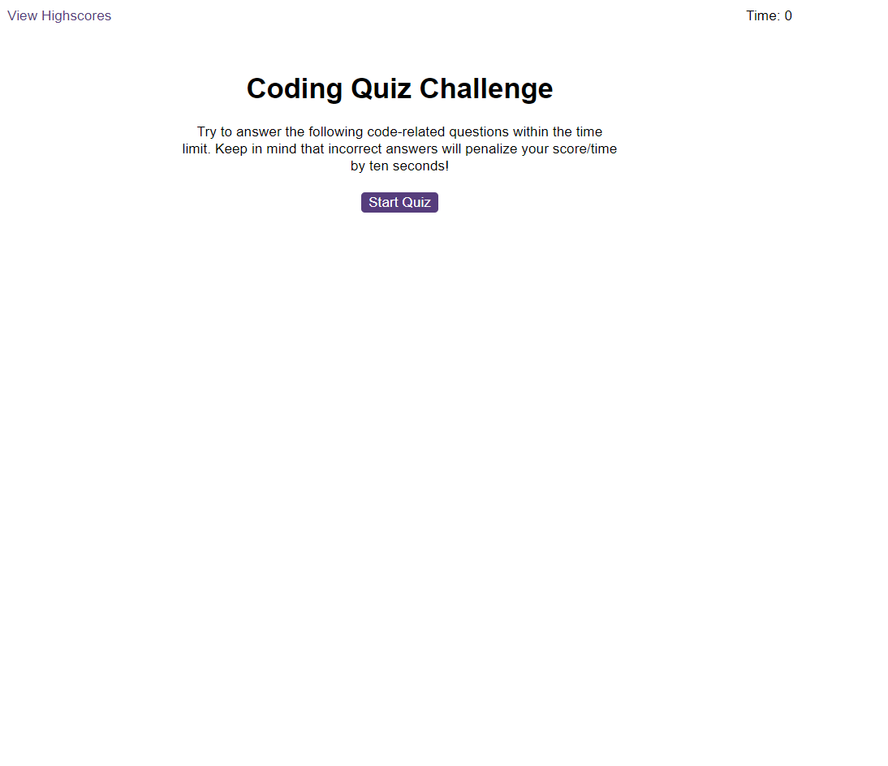

# JavascriptQuiz

In this week's bootcamp challenge, we were tasked with creating a javascript quiz with various functionality.The main features we had to implement were as listed; a timer must count down from the start of the quiz,correct answers were met with a correct sound snippet, an incorrect answer would be  met with an incorrect sound and also 10 seconds deduction  from the timer. We also had to use local storage to be able to save high scores to a list on an external HTML page, and also write a function to be able to clear the local storage which in turn clears the high score list.

## introduction
 

## Technologies
Project is created JAVASCRIPT HTML AND CSS

## Image of web page

## Link to live site
https://gpsnm.github.io/JavascriptQuiz/
